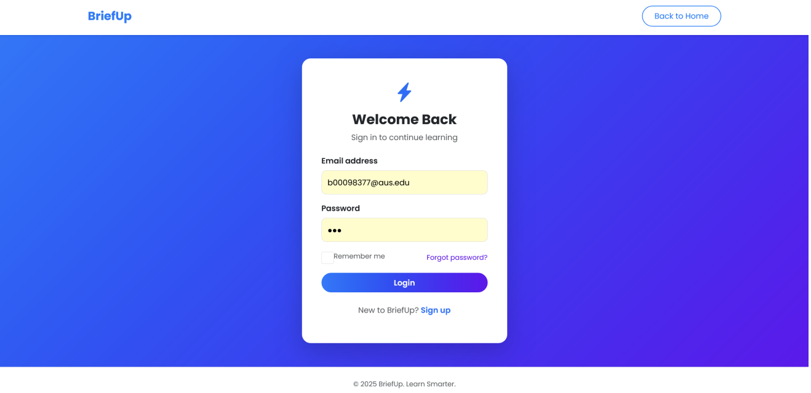
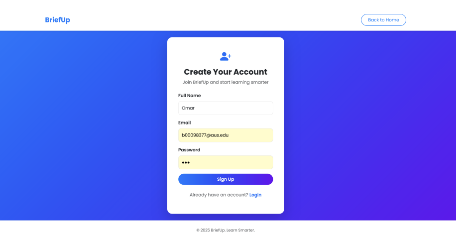
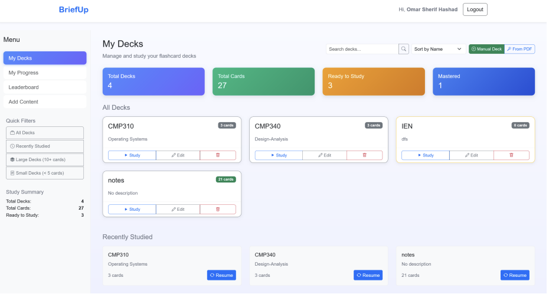
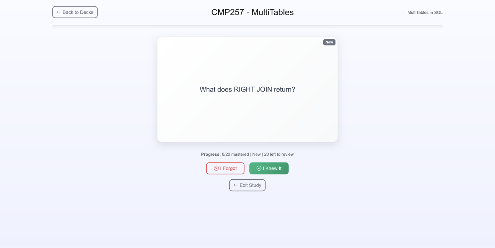
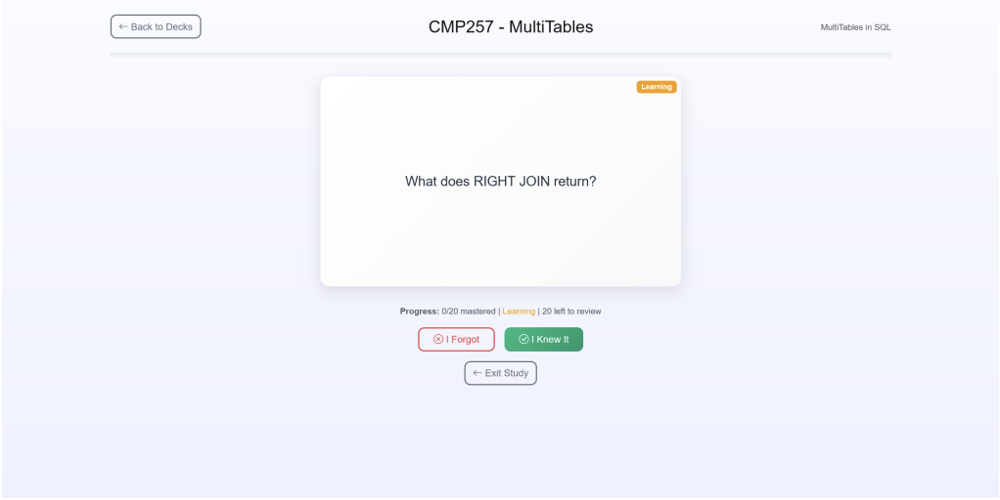
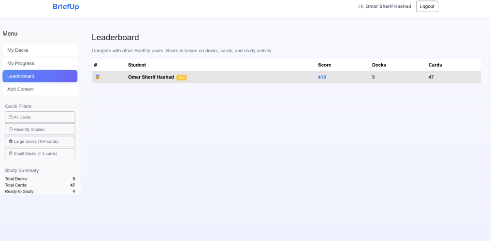

# BriefUp

BriefUp is an AI-powered flashcard web application designed to help students study efficiently using AI-generated flashcards and spaced repetition.

## Tech Stack
- Java Servlets
- JSP / HTML / CSS / JavaScript
- MySQL
- Apache Tomcat
- OpenAI API

## Features
- User authentication
- Flashcard deck management
- AI-generated flashcards from PDFs
- Study sessions and statistics
- Leaderboard

## Setup Instructions
1. Clone the repository
2. Import the project into Eclipse
3. Configure the MySQL database
4. Set the `OPENAI_API_KEY` environment variable
5. Deploy the project on Apache Tomcat

## Screenshots

### Login

### Signup

### Dashboard

### Deck Editor

### Study Mode

### Quiz Results

### Leaderboard

## Author
Fares Mallah
